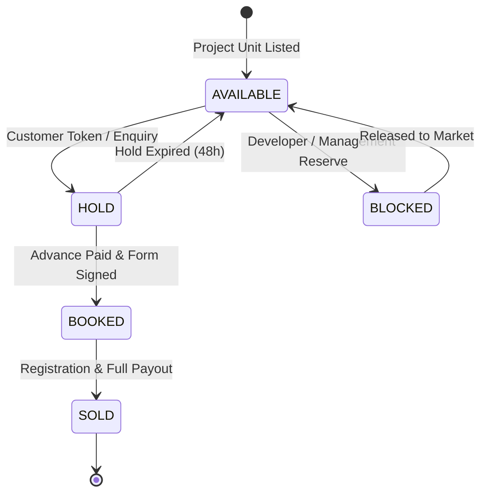
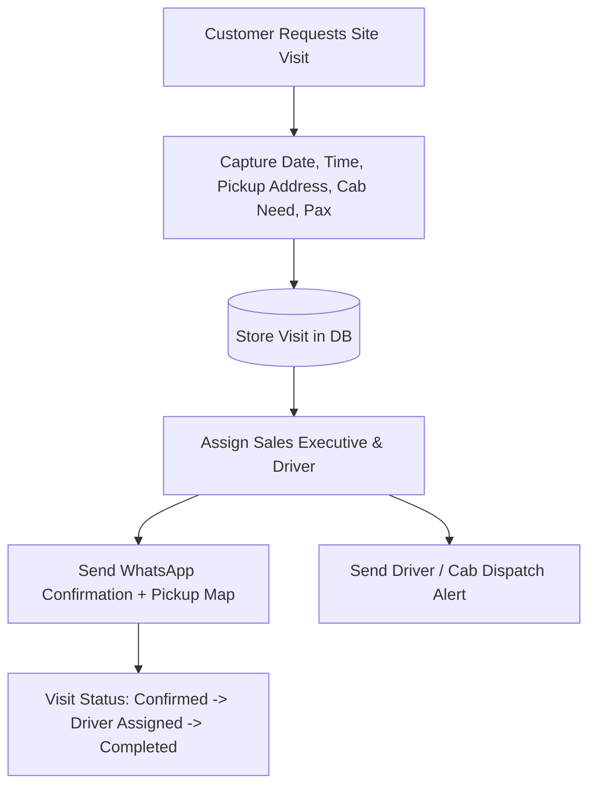
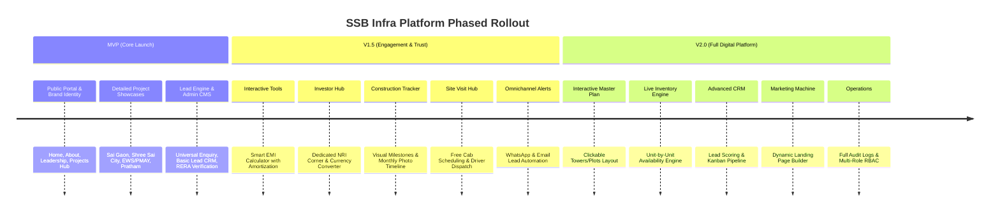

# SSB Infra Real Estate Platform — Master Project Plan & System Architecture (Version 2.1)
**Project:** Enterprise Real Estate Digital Platform & Integrated Operations Engine  
**Client / Brand:** SSB Infra Project (`ssbinfraproject.com`)  
**Version:** 2.1 (Production Blueprint with Live Inventory, Multi-stage CRM, RERA Trust Hub, & Notification Engine)  
**Date:** August 2026  

---

## 1. Executive Summary & Vision Statement

### Final Objective:
To build **SSB Infra not as a simple marketing website, but as a complete, unified Real Estate Digital Platform** seamlessly interconnecting:

$$\text{Public Portal} \longleftrightarrow \text{Projects \& RERA} \longleftrightarrow \text{Interactive Master Plan} \longleftrightarrow \text{Unit/Plot Inventory} \longleftrightarrow \text{Leads \& Scoring CRM} \longleftrightarrow \text{Site Visit Logistics} \longleftrightarrow \text{Omnichannel Notifications} \longleftrightarrow \text{Admin CMS}$$

The platform is engineered from Day 1 to be highly scalable, allowing new projects, residential towers, commercial blocks, plot layouts, sales executives, and targeted digital marketing campaigns to be deployed dynamically without code refactoring.

---

## 2. Platform Architecture & Data Flow

```text
                                  ┌─────────────────────────────────────────┐
                                  │             PUBLIC WEBSITE              │
                                  │ (Next.js 14/15 App Router + TypeScript) │
                                  └────────────────────┬────────────────────┘
                                                       │
                                                       ▼
                                  ┌─────────────────────────────────────────┐
                                  │          APPLICATION / API LAYER        │
                                  │   (Server Actions + REST + NextAuth)    │
                                  └────────────────────┬────────────────────┘
                                                       │
                     ┌─────────────────────────────────┼─────────────────────────────────┐
                     ▼                                 ▼                                 ▼
        ┌─────────────────────────┐       ┌─────────────────────────┐       ┌─────────────────────────┐
        │       PostgreSQL        │       │  Cloud Storage + CDN    │       │     Integrations        │
        │      (Prisma ORM)       │       │   (Cloudflare R2/S3)    │       │ (WhatsApp, Resend, SMS) │
        │  Backups & PIT Recovery │       │   Images, Docs, Plans   │       │   Google Maps, Turnstile│
        └────────────┬────────────┘       └────────────┬────────────┘       └────────────┬────────────┘
                     │                                 │                                 │
                     └─────────────────────────────────┼─────────────────────────────────┘
                                                       │
                                                       ▼
                                  ┌─────────────────────────────────────────┐
                                  │             BUSINESS ENGINE             │
                                  ├────────────────────┬────────────────────┤
                                  │ • Lead CRM Engine  │ • Inventory Engine │
                                  │ • Lead Scoring     │ • Master Plan Map  │
                                  │ • Site Visits Hub  │ • RERA Compliance  │
                                  │ • Notifications    │ • Construction Log │
                                  └────────────────────┬────────────────────┘
                                                       │
                                                       ▼
                                  ┌─────────────────────────────────────────┐
                                  │            ADMIN CMS & CRM              │
                                  │ (Role-Based Access: Super/Sales/Content)│
                                  └─────────────────────────────────────────┘
```

---

## 3. Core Functional Pillars (23-Point Specification)

### 3.1. Database Architecture (PostgreSQL from Day One)
- **Engine**: PostgreSQL 16+ configured from day one for Local, Development, Staging, and Production environments.
- **No interim SQLite migration strategy**: Prevents data type drift, concurrency locks, and enum mismatches.
- **ORM & Migrations**: Prisma ORM with strictly typed models, indexes, composite keys, and automated migration scripts.
- **Data Protection**: Automated hourly/daily database snapshots, off-site encrypted backups, and Point-in-Time Recovery (PITR).

---

### 3.2. Real Estate Inventory & Availability Engine
A dedicated live inventory tracking engine for every plot, flat, and commercial space across all projects.



- **Unit/Plot Data Attributes**:
  - `Unit/Plot Number` (e.g., Tower A - 402, Plot #118)
  - `Project ID` & `Tower / Block / Sector`
  - `Floor Number` & `Unit Type` (1BHK, 2BHK Compact, 2BHK Luxury, 3BHK, 4BHK Villa, Commercial Plot)
  - `Super Built-up Area`, `Carpet Area (RERA)` & `Facing` (East, North-East, Vastu-compliant)
  - `Base Price`, `PLC (Prime Location Charges)`, `Total Cost Estimate`
  - `Status`: `AVAILABLE`, `HOLD`, `BOOKED`, `SOLD`, `BLOCKED`
  - `Booking Date`, `Allotted Customer/Lead ID`, `Assigned Salesperson`

---

### 3.3. Interactive Master Plan & Unit Explorer
- **Interactive SVG / Canvas Master Plan Engine**:
  - Responsive vector overlay on high-resolution master layout drawings.
  - Interactive clickable hotspots for Towers, Blocks, Plots, Parks, Clubhouse, and Entrance Gates.
- **Dynamic Unit Quick-View Modal**:
  - Clicking any plot or unit displays:
    - Unit/Plot Number & Configuration (e.g. "Plot 42 — 1500 Sq. Ft.")
    - Facing, Floor, Carpet Area
    - Live Price Calculation
    - Real-Time Availability Tag (`Available`, `On Hold`, `Sold`)
    - Direct CTAs: **[Enquire About This Unit]** and **[Schedule Site Visit]**
- **Direct Database Sync**: Real-time inventory status sync so that when a unit status changes in the Admin CMS, the public master layout updates instantly.

---

### 3.4. RERA & Legal Trust Hub
Dedicated transparency center integrated into every project page and a standalone `/rera-compliance` directory:
- **Verified Data Points**:
  - RERA Registration Number (e.g., `UPRERAPRJXXXXXX`)
  - RERA Competent Authority Name
  - Registration Date & Validity Period
  - Promoter & Developer Entity Name
- **Downloadable & Verified Documents**:
  - Approved Site Plan & Sanctioned Building Layouts (PDF)
  - NOC from Fire, Airport, and Environmental Authorities
  - Encumbrance-Free Title Deeds / Legal Search Reports
  - Official Project E-Brochure & Allotment Terms
- **Interactive Verification**:
  - Direct "Verify on Official RERA Portal" button linking directly to the State RERA authority page.
  - Interactive RERA QR Code scanner widget.
  - Strict publication rule: All RERA/legal uploads require Super Admin / Legal Manager approval before going live.

---

### 3.5. Site Visit Management System
A full logistics booking and dispatch system replacing basic static enquiry forms:



- **Data Attributes**:
  - Customer Name, Phone, Email
  - Target Project & Preferred Configuration
  - Date & Time Slot
  - Pickup Location & `Cab Required` (Yes / No)
  - Number of Visitors
  - Assigned Sales Executive & Driver Details
  - Status: `REQUESTED`, `CONFIRMED`, `DRIVER_ASSIGNED`, `COMPLETED`, `CANCELLED`, `NO_SHOW`
  - Post-Visit Feedback & Executive Meeting Notes

---

### 3.6. Advanced Lead CRM & Pipeline Workflow
Visual Kanban and tabular lead management system tailored specifically for real estate sales lifecycles:

$$\textbf{NEW} \longrightarrow \textbf{CONTACTED} \longrightarrow \textbf{QUALIFIED} \longrightarrow \textbf{SITE VISIT SCHEDULED} \longrightarrow \textbf{SITE VISIT COMPLETED} \longrightarrow \textbf{NEGOTIATION} \longrightarrow \textbf{BOOKING} \longrightarrow \textbf{CONVERTED}$$
$$\Big\downarrow$$
$$\textbf{LOST}$$

- **Comprehensive Lead Record**:
  - Source (`WEBSITE_DIRECT`, `BROCHURE_DOWNLOAD`, `SITE_VISIT_MODAL`, `WHATSAPP_TRIGGER`, `LANDING_PAGE`)
  - Campaign metadata: `utm_source`, `utm_medium`, `utm_campaign`, `utm_content`
  - Interested Project, Tower, and specific Unit/Plot
  - Assigned Sales Executive
  - Next Follow-Up Reminder (Date & Time with browser/calendar alert)
  - Omnichannel Communication History: Logged Phone Calls, WhatsApp Messages, Emails, and Site Visits
  - Attached Customer Documents (Aadhaar, PAN, Booking Form, Payment Receipts)
  - Dynamic **Lead Score & Priority Tag**

---

### 3.7. Automated Lead Scoring System
Algorithmic classification engine to prioritize high-intent buyers for immediate sales outreach:

| Score Tier | Criteria / Trigger Behaviors | Dashboard Action & SLA |
|---|---|---|
| 🔥 **HOT LEAD** | • Requested Immediate Callback in 60s<br>• Scheduled a Site Visit with Cab Request<br>• Visited project page $\ge 3$ times & downloaded brochure<br>• Selected specific unit on Master Plan | Instant SMS/WhatsApp push to Sales Manager.<br>**SLA: Response within 5 minutes**. |
| ⚡ **WARM LEAD** | • Downloaded Project E-Brochure<br>• Interacted with EMI Calculator & adjusted budget<br>• General inquiry submitted via contact form | Automated WhatsApp brochure delivery + CRM queue.<br>**SLA: Call within 2 hours**. |
| ❄️ **COLD LEAD** | • Newsletter signup<br>• General inquiry with missing telephone verification | Automated email nurture sequence. |

- **Dashboard Display**: Real-time counter widgets on the Admin Dashboard displaying Hot Leads count, overdue follow-ups, and conversion velocity.

---

### 3.8. Omnichannel Notification Engine
A centralized asynchronous notification dispatcher supporting official WhatsApp Cloud API, Resend/SendGrid Email, and SMS Gateway:

```text
                         ┌──────────────────────────────────────────────┐
                         │         Central Notification Service         │
                         └──────────────────────┬───────────────────────┘
                                                │
                 ┌──────────────────────────────┼──────────────────────────────┐
                 ▼                              ▼                              ▼
    ┌─────────────────────────┐    ┌─────────────────────────┐    ┌─────────────────────────┐
    │  WhatsApp Business API  │    │     Email (Resend/SMTP) │    │       SMS Gateway       │
    └─────────────────────────┘    └─────────────────────────┘    └─────────────────────────┘
```

- **Automated Workflows**:
  1. *Brochure Delivery*: Instant WhatsApp PDF delivery + Email download link within 5 seconds of lead form submission.
  2. *Enquiry Acknowledgment*: Immediate welcome message with assigned relationship manager's direct contact card.
  3. *Site Visit Confirmation*: Instant calendar invite + pickup point coordinates + assigned driver details.
  4. *Site Visit Reminder*: Automated WhatsApp reminder 3 hours and 30 minutes prior to the scheduled slot.
  5. *Callback Confirmation*: "Our property advisor will call you in 60 seconds" confirmation push.
  6. *Sales Follow-Up*: Automated prompts to sales reps for leads whose next follow-up date has arrived.
  7. *Booking Confirmation*: Formal milestone notification upon advance payment and unit allocation.

---

### 3.9. Construction Progress Tracker
Visual, stage-by-stage construction timeline providing transparent updates to homebuyers and investors:
- **Milestone Phases Tracked**:
  `1. Foundation / Excavation` $\rightarrow$ `2. RCC Structure` $\rightarrow$ `3. Brickwork & Masonry` $\rightarrow$ `4. Electrical & Plumbing (MEP)` $\rightarrow$ `5. Internal & External Plaster` $\rightarrow$ `6. Flooring & Tiling` $\rightarrow$ `7. Painting & Glazing` $\rightarrow$ `8. Final Finishing & Landscaping` $\rightarrow$ `9. Handover Ready`
- **Display Capabilities**:
  - Overall Project Percentage Completion Bar (e.g. `78% Completed`).
  - Tower-by-Tower / Block-by-Block progress breakout.
  - Monthly chronological photo gallery with high-resolution site progress imagery.
  - Drone video walkthrough embed with recorded month/year timestamp.

---

### 3.10. Smart EMI & Investment Calculator
- **Inputs**:
  - Property Price (₹ Lakhs / Crores)
  - Down Payment Amount / Percentage (e.g., 20%)
  - Loan Amount (Calculated dynamically)
  - Annual Interest Rate (% slider, default 8.5%)
  - Loan Tenure (Years slider: 5 to 30 years)
  - Bank Processing Fee (%)
- **Outputs & Visualizations**:
  - Monthly EMI Amount (Large prominent badge)
  - Interactive Donut Chart: Total Principal vs. Total Interest Payable
  - Total Loan Cost (Principal + Interest + Fees)
  - Full Year-by-Year & Month-by-Month Amortization Schedule Table
  - Direct Action CTA: **[Check Bank Loan Eligibility for this Project]**
- **Mandatory Legal Disclaimer**:
  > *"Indicative calculation only. Actual loan terms, interest rates, eligibility, and processing charges are determined by the respective financing institution/bank."*

---

### 3.11. Investor & NRI Dedicated Corner (`/nri-corner`)
Specialized international investment portal designed to answer global NRI questions and streamline remote acquisition:
- **Core Knowledge Modules**:
  - Step-by-Step Guide to Buying Property in India as an NRI / PIO / OCI.
  - Permissible Banking Channels (NRE / NRO Accounts, FCNR deposits, inward remittances).
  - Power of Attorney (POA) registration and attestation procedures.
  - Repatriation of sales proceeds and rental income under RBI / FEMA regulations.
  - Tax implications (TDS on property purchase, Capital Gains exemption under Section 54).
  - Pre-approved Home Loans for NRIs (SBI, HDFC, ICICI NRI home loans).
  - SSB Infra Post-Purchase Property Management & Rental Assistance services.
- **Dedicated NRI Conversion Triggers**:
  - Real-time Multi-Currency Price Converter (USD, AED, GBP, EUR, CAD, INR).
  - Book a 1-on-1 Virtual Video Walkthrough (Zoom / Google Meet).
  - Dedicated NRI Relationship Manager direct WhatsApp desk.

---

### 3.12. CMS-Driven Marketing Landing Page Builder
Enables non-technical marketing teams to generate high-converting SEO landing pages dynamically without code deployments:
- **Example Generated URLs**:
  - `/2bhk-apartments-varanasi`
  - `/luxury-homes-varanasi`
  - `/plots-varanasi`
  - `/diwali-festive-project-offer`
- **Configurable Landing Page Builder Components**:
  - Custom Hero Headline, Sub-headline, and Background Visual
  - Associated Project Association & Featured Units Selector
  - Embedded Fast Lead Capture Form with UTM Tracking
  - Dynamic Benefit / Feature Cards and Testimonial Strip
  - Custom SEO Title, Meta Description, Open Graph Share Image, and Canonical URL
  - Instant One-Click Publish / Unpublish Toggle

---

### 3.13. Media Asset Management System
- **Storage Infrastructure**: Cloudflare R2 / AWS S3 with global Cloudflare CDN distribution.
- **Media Categories**:
  - Project Photography (Exterior, Interior, Amenities, Elevation)
  - Floor Plan Diagrams (2D architectural blueprints, 3D renders)
  - Official Legal Documents & RERA Sanctions (PDF)
  - E-Brochures & Price Sheets (PDF)
  - Monthly Construction Progress Shots & Drone Walkthroughs
  - Executive Leadership & Customer Testimonial Media
- **Database Tracking**: Auto-generates WebP/AVIF thumbnails, image dimensions, accessibility alt text, upload timestamps, and sort order.

---

### 3.14. Role-Based Access Control (RBAC)
Strict enterprise permissions preventing unauthorized access:

| Role | Access Permissions & Boundaries |
|---|---|
| **Super Admin** | Full root access: User management, role assignment, system configs, audit logs, database backups, all CMS modules, and lead exports. |
| **Sales Manager** | Full CRM access: Leads pipeline, Site Visit logistics, Lead reassignment, Call/WhatsApp logs, Inventory status updates, Analytics. *No access to user accounts or system settings*. |
| **Content Editor** | CMS access: Projects editing, Blog/News, Gallery uploads, Construction photo updates, FAQs, Testimonials. *No access to Lead CRM or financial data*. |
| **Future Extensions** | `Sales Executive` (own assigned leads only), `Marketing Manager` (landing pages & analytics), `Legal Manager` (RERA & document verification). |

---

### 3.15. Comprehensive Audit Log Engine
Every critical state change and financial/inventory update is immutably logged with an audit trail:

```text
[AUDIT LOG ENTRY]
Timestamp:   2026-08-18T14:30:00+05:30
Admin User:  Rajesh Sharma (ID: usr_8921)
Role:        Sales Manager
Action:      PROJECT_PRICE_UPDATED
Entity:      Project (Shree Sai City Housing - prj_4401)
Old Value:   {"startingPrice": 5200000, "priceDisplay": "₹52 Lakhs Onwards"}
New Value:   {"startingPrice": 5500000, "priceDisplay": "₹55 Lakhs Onwards"}
IP Address:  103.21.124.89
```

- **Audited Events**:
  - Project creation, editing, pricing updates, and archiving
  - Unit/Plot availability status changes (`AVAILABLE` $\rightarrow$ `SOLD`)
  - Lead assignments, status changes, and deletion attempts
  - User creation, password resets, and role modifications
  - RERA and legal document uploads/replacements

---

### 3.16. Analytics & Conversion Tracking Architecture
- **Captured Events**:
  - Project & Property Detail Page Views
  - CTA Button Clicks (`Enquire Now`, `Book Site Visit`, `Download Brochure`)
  - Direct Phone Call & WhatsApp Click Triggers
  - Gated Brochure Download Submissions
  - Site Visit Appointment Submissions
  - Marketing Campaign Attribution (`utm_source`, `utm_medium`, `utm_campaign`, `utm_content`)
- **Executive Analytics Dashboard Visualizations**:
  - Total Monthly Inquiries & Inquiry Velocity
  - Hot Leads vs. Warm Leads Breakdown
  - Site Visits Completed & Conversion Rate (%)
  - Project-Wise Popularity & Download Heatmap
  - Top Performing Traffic Sources (Google Ads, Facebook/Instagram, Organic Search, Direct)

---

### 3.17. Enterprise Search Engine Optimization (SEO)
- **Technical SEO**:
  - Automated XML Sitemap (`/sitemap.xml`) generation for all static pages, dynamic project pages, and marketing landing pages.
  - Strict `robots.txt` configuration indexing public pages and blocking `/admin/*` and API routes.
  - Canonical URL tags to avoid duplicate content penalties.
  - Semantic HTML5 structure (`<h1>`, `<h2>`, `<article>`, `<section>`, `<nav>`).
  - Next.js Image Optimization with mandatory descriptive `alt` tags and zero Cumulative Layout Shift (CLS).
- **Structured Data (JSON-LD Schemas)**:
  - `RealEstateAgent` & `LocalBusiness` on Homepage & Contact page.
  - `ApartmentComplex` / `SingleFamilyResidence` on Project Detail pages with verified RERA IDs, coordinates, and pricing.
  - `FAQPage` schema on FAQ and Project pages for rich Google Search snippet accordions.
  - `BreadcrumbList` schema for seamless hierarchical search navigation.

---

### 3.18. Security & Compliance Architecture
- **Transport & Headers**: Mandatory HTTPS with HSTS, CSP (Content Security Policy), X-Frame-Options, X-Content-Type-Options, and Referrer-Policy headers.
- **Server-Side Validation**: Zod schema validation on 100% of incoming Server Actions and REST API payloads.
- **Anti-Abuse & Rate Limiting**: Cloudflare Turnstile / reCAPTCHA v3 on all lead forms + IP-based rate limiting on public submission endpoints.
- **Credential Safety**: Zero API secrets or database connection strings in client-side code; strictly accessed via environment variables on the server.
- **Authentication**: Bcrypt password hashing (12 rounds) with cryptographically secure session tokens.

---

### 3.19. Testing & Quality Assurance Plan
- **Unit Testing**: Vitest / Jest tests covering:
  - EMI Calculation formulas and amortization schedule generation.
  - Lead Scoring algorithm weighting.
  - Validation schemas (phone number normalization, email sanitization).
- **Integration Testing**:
  - Database CRUD operations with Prisma.
  - API endpoint response codes and error handling.
  - Notification dispatcher queue logic.
- **End-to-End (E2E) Testing with Playwright**:
  - Flow 1: Visitor browses project $\rightarrow$ opens interactive master plan $\rightarrow$ selects unit $\rightarrow$ submits enquiry $\rightarrow$ verifies lead created in DB.
  - Flow 2: Visitor requests free site visit with cab $\rightarrow$ receives automated confirmation $\rightarrow$ Admin verifies booking in Site Visit Manager.
  - Flow 3: Admin logs in $\rightarrow$ creates/edits project $\rightarrow$ updates unit availability $\rightarrow$ verifies public site reflects updated status.

---

### 3.20. Monitoring, Reliability & Disaster Recovery
- **Error Tracking**: Sentry / OpenTelemetry integration for real-time frontend and backend error capturing with stack traces.
- **Uptime Monitoring**: External synthetic health check pinging `/api/health` every 60 seconds with instant Slack/Email alerts upon downtime.
- **Database Disaster Recovery**:
  - Daily full database dumps stored in isolated encrypted cloud storage.
  - Hourly differential backups with tested 15-minute Recovery Time Objective (RTO).

---

### 3.21. Multi-Tier Environment Strategy

```text
┌──────────────┐     ┌──────────────────┐     ┌─────────────────┐     ┌──────────────────┐
│    LOCAL     │ ──► │   DEVELOPMENT    │ ──► │     STAGING     │ ──► │    PRODUCTION    │
│  Developer   │     │ CI/CD automated  │     │ Client preview  │     │ Live high-perf   │
│ Workstations │     │ branch testing   │     │ & QA validation │     │ custom domain    │
└──────────────┘     └──────────────────┘     └─────────────────┘     └──────────────────┘
```
- Strict protocol: No experimental feature is deployed to production without passing staging validation.

---

### 3.22. Progressive Release Strategy



---

## 4. Complete Enterprise Prisma Database Schema (PostgreSQL)

```prisma
datasource db {
  provider = "postgresql"
  url      = env("DATABASE_URL")
}

generator client {
  provider = "prisma-client-js"
}

// -------------------------------------------------------------
// ENUMS
// -------------------------------------------------------------

enum Role {
  SUPER_ADMIN
  SALES_MANAGER
  CONTENT_EDITOR
  SALES_EXECUTIVE
  LEGAL_MANAGER
}

enum ProjectStatus {
  UPCOMING
  ONGOING
  READY_TO_MOVE
  COMPLETED
}

enum PropertyType {
  RESIDENTIAL_APARTMENT
  GROUP_HOUSING
  AFFORDABLE_HOUSING_PMAY
  LUXURY_VILLA
  COMMERCIAL_RETAIL
  RESIDENTIAL_PLOT
}

enum UnitStatus {
  AVAILABLE
  HOLD
  BOOKED
  SOLD
  BLOCKED
}

enum LeadStatus {
  NEW
  CONTACTED
  QUALIFIED
  SITE_VISIT_SCHEDULED
  SITE_VISIT_COMPLETED
  NEGOTIATION
  BOOKING
  CONVERTED
  LOST
}

enum LeadPriority {
  HOT
  WARM
  COLD
}

enum SiteVisitStatus {
  REQUESTED
  CONFIRMED
  DRIVER_ASSIGNED
  COMPLETED
  CANCELLED
  NO_SHOW
}

// -------------------------------------------------------------
// USER & RBAC
// -------------------------------------------------------------

model User {
  id               String       @id @default(uuid())
  name             String
  email            String       @unique
  phone            String?
  passwordHash     String
  role             Role         @default(CONTENT_EDITOR)
  isActive         Boolean      @default(true)
  
  assignedLeads    Lead[]       @relation("AssignedSalesperson")
  assignedVisits   SiteVisit[]  @relation("AssignedVisitSalesperson")
  leadNotes        LeadNote[]
  auditLogs        AuditLog[]

  createdAt        DateTime     @default(now())
  updatedAt        DateTime     @updatedAt
}

// -------------------------------------------------------------
// PROJECT CORE
// -------------------------------------------------------------

model Project {
  id                 String                 @id @default(uuid())
  slug               String                 @unique
  title              String
  tagline            String?
  description        String                 @db.Text
  projectType        PropertyType
  status             ProjectStatus          @default(ONGOING)
  
  // RERA & Legal Trust Hub
  reraNumber         String?
  reraAuthority      String?                // e.g. "Uttar Pradesh Real Estate Regulatory Authority"
  reraQrUrl          String?
  reraRegistrationDate DateTime?
  promoterName       String?
  sanctionedLayoutDocUrl String?
  legalClearanceDocUrl   String?

  // Financials & Specs
  startingPrice      Decimal?               @db.Decimal(12, 2)
  priceDisplay       String?                // e.g. "₹45 Lakhs Onwards"
  locationName       String                 // e.g. "Shivpur, Varanasi"
  fullAddress        String
  latitude           Float?
  longitude          Float?
  totalLandArea      String?                // e.g. "22 Acres"
  totalUnitsCount    Int?
  
  // Media Assets
  featuredImage      String
  heroImages         String[]
  masterPlanSvgUrl   String?
  brochureUrl        String?
  virtualTourUrl     String?

  isFeatured         Boolean                @default(false)
  isPublished        Boolean                @default(true)

  // Relations
  configurations     ProjectConfiguration[]
  units              ProjectUnit[]
  amenities          ProjectAmenity[]
  specifications     ProjectSpecification[]
  constructionStages ConstructionStage[]
  mediaAssets        MediaAsset[]
  faqs               ProjectFaq[]
  leads              Lead[]
  siteVisits         SiteVisit[]
  landingPages       MarketingLandingPage[]

  // SEO Metadata
  metaTitle          String?
  metaDescription    String?
  keywords           String[]

  createdAt          DateTime               @default(now())
  updatedAt          DateTime               @updatedAt
}

// -------------------------------------------------------------
// CONFIGURATIONS & INVENTORY ENGINE
// -------------------------------------------------------------

model ProjectConfiguration {
  id               String        @id @default(uuid())
  projectId        String
  project          Project       @relation(fields: [projectId], references: [id], onDelete: Cascade)
  title            String        // e.g. "3 BHK Royal Luxury"
  bhkType          String        // e.g. "3 BHK"
  superBuiltupArea Float         // in Sq. Ft.
  carpetArea       Float         // in Sq. Ft.
  bedrooms         Int
  bathrooms        Int
  balconies        Int
  floorPlan2dUrl   String
  floorPlan3dUrl   String?
  priceEstimate    String?

  units            ProjectUnit[]

  createdAt        DateTime      @default(now())
  updatedAt        DateTime      @updatedAt
}

model ProjectUnit {
  id               String                @id @default(uuid())
  projectId        String
  project          Project               @relation(fields: [projectId], references: [id], onDelete: Cascade)
  configurationId  String?
  configuration    ProjectConfiguration? @relation(fields: [configurationId], references: [id], onDelete: SetNull)

  unitNumber       String                // e.g. "Tower-B-804" or "Plot-55"
  towerBlock       String?               // e.g. "Tower B"
  floorNumber      Int?
  unitType         String                // "Apartment", "Plot", "Villa"
  facing           String?               // "North-East", "East", "Park Facing"
  areaSqFt         Float
  basePrice        Decimal               @db.Decimal(12, 2)
  plcAmount        Decimal               @default(0) @db.Decimal(12, 2)
  totalPrice       Decimal               @db.Decimal(12, 2)
  status           UnitStatus            @default(AVAILABLE)

  bookingDate      DateTime?
  bookedLeadId     String?
  bookedLead       Lead?                 @relation("BookedUnit", fields: [bookedLeadId], references: [id], onDelete: SetNull)

  createdAt        DateTime              @default(now())
  updatedAt        DateTime              @updatedAt

  @@unique([projectId, unitNumber])
}

// -------------------------------------------------------------
// AMENITIES & SPECIFICATIONS
// -------------------------------------------------------------

model ProjectAmenity {
  id          String   @id @default(uuid())
  projectId   String
  project     Project  @relation(fields: [projectId], references: [id], onDelete: Cascade)
  name        String
  category    String   // "Health & Sports", "Leisure", "Eco-Living", "Security"
  iconName    String?
  description String?
}

model ProjectSpecification {
  id        String   @id @default(uuid())
  projectId String
  project   Project  @relation(fields: [projectId], references: [id], onDelete: Cascade)
  category  String   // "Structure", "Flooring", "Doors & Windows", "Kitchen", "Electrical", "Plumbing"
  details   String   @db.Text
}

// -------------------------------------------------------------
// CONSTRUCTION TRACKER
// -------------------------------------------------------------

model ConstructionStage {
  id           String   @id @default(uuid())
  projectId    String
  project      Project  @relation(fields: [projectId], references: [id], onDelete: Cascade)
  towerBlock   String?  // Optional: tower specific or whole project
  stageName    String   // "Excavation", "RCC Structure", "Brickwork", "Plaster", "Finishing"
  percentage   Int      // 0 to 100
  updateMonth  String   // e.g. "August 2026"
  notes        String?  @db.Text
  imageUrls    String[]
  droneVideoUrl String?
  updatedAt    DateTime @default(now())
}

// -------------------------------------------------------------
// LEADS & CRM PIPELINE
// -------------------------------------------------------------

model Lead {
  id               String          @id @default(uuid())
  fullName         String
  email            String
  phone            String
  source           String          @default("WEBSITE_DIRECT") // "BROCHURE_DOWNLOAD", "SITE_VISIT", "CALLBACK_60S", "WHATSAPP", "LANDING_PAGE"
  status           LeadStatus      @default(NEW)
  priority         LeadPriority    @default(WARM)
  
  interestedType   PropertyType?
  projectId        String?
  project          Project?        @relation(fields: [projectId], references: [id], onDelete: SetNull)
  interestedUnit   String?
  budgetRange      String?
  message          String?         @db.Text

  // Campaign & UTM
  utmSource        String?
  utmMedium        String?
  utmCampaign      String?
  utmContent       String?
  ipAddress        String?

  // Assigned Staff & Follow-ups
  assignedToId     String?
  assignedTo       User?           @relation("AssignedSalesperson", fields: [assignedToId], references: [id])
  nextFollowUpAt   DateTime?

  // Relations
  notes            LeadNote[]
  siteVisits       SiteVisit[]
  bookedUnits      ProjectUnit[]   @relation("BookedUnit")

  createdAt        DateTime        @default(now())
  updatedAt        DateTime        @updatedAt
}

model LeadNote {
  id          String   @id @default(uuid())
  leadId      String
  lead        Lead     @relation(fields: [leadId], references: [id], onDelete: Cascade)
  authorId    String
  author      User     @relation(fields: [authorId], references: [id])
  noteType    String   @default("GENERAL") // "CALL_LOG", "WHATSAPP_LOG", "MEETING_NOTE", "STATUS_CHANGE"
  comment     String   @db.Text
  createdAt   DateTime @default(now())
}

// -------------------------------------------------------------
// SITE VISIT LOGISTICS
// -------------------------------------------------------------

model SiteVisit {
  id               String          @id @default(uuid())
  leadId           String
  lead             Lead            @relation(fields: [leadId], references: [id], onDelete: Cascade)
  projectId        String
  project          Project         @relation(fields: [projectId], references: [id], onDelete: Cascade)
  
  scheduledDate    DateTime
  timeSlot         String          // e.g. "11:00 AM - 12:30 PM"
  pickupAddress    String?
  cabRequired      Boolean         @default(false)
  numberOfVisitors Int             @default(1)
  driverDetails    String?         // e.g. "Driver: Ramesh (UP65 AB 1234)"
  status           SiteVisitStatus @default(REQUESTED)
  
  assignedToId     String?
  assignedTo       User?           @relation("AssignedVisitSalesperson", fields: [assignedToId], references: [id])
  feedbackNotes    String?         @db.Text

  createdAt        DateTime        @default(now())
  updatedAt        DateTime        @updatedAt
}

// -------------------------------------------------------------
// MARKETING LANDING PAGES & CMS
// -------------------------------------------------------------

model MarketingLandingPage {
  id              String   @id @default(uuid())
  slug            String   @unique // e.g. "2bhk-apartments-varanasi"
  pageTitle       String
  heroHeadline    String
  heroSubheadline String?
  heroImageUrl    String
  
  projectId       String?
  project         Project? @relation(fields: [projectId], references: [id], onDelete: SetNull)
  
  contentHtml     String?  @db.Text
  ctaButtonText   String   @default("Enquire Now")
  isPublished     Boolean  @default(false)

  // SEO & Social
  metaTitle       String
  metaDescription String
  ogImageUrl      String?

  createdAt       DateTime @default(now())
  updatedAt       DateTime @updatedAt
}

model MediaAsset {
  id           String   @id @default(uuid())
  projectId    String?
  project      Project? @relation(fields: [projectId], references: [id], onDelete: SetNull)
  category     String   // "EXTERIOR", "INTERIOR", "AMENITIES", "CONSTRUCTION", "LEGAL", "BROCHURE"
  fileUrl      String
  thumbnailUrl String?
  title        String?
  altText      String
  sortOrder    Int      @default(0)
  createdAt    DateTime @default(now())
}

model ProjectFaq {
  id        String   @id @default(uuid())
  projectId String?
  project   Project? @relation(fields: [projectId], references: [id], onDelete: Cascade)
  category  String   @default("General") // "Home Buying", "RERA/Legal", "Loans", "NRI"
  question  String
  answer    String   @db.Text
  order     Int      @default(0)
}

model Leadership {
  id          String   @id @default(uuid())
  name        String
  designation String
  bio         String   @db.Text
  photoUrl    String
  linkedInUrl String?
  order       Int      @default(0)
}

// -------------------------------------------------------------
// AUDIT LOGS
// -------------------------------------------------------------

model AuditLog {
  id         String   @id @default(uuid())
  userId     String?
  user       User?    @relation(fields: [userId], references: [id], onDelete: SetNull)
  action     String   // e.g. "PROJECT_PRICE_UPDATED", "UNIT_STATUS_CHANGED", "LEAD_ASSIGNED"
  entityType String   // "Project", "ProjectUnit", "Lead", "SiteVisit", "User"
  entityId   String
  oldValues  Json?
  newValues  Json?
  ipAddress  String?
  createdAt  DateTime @default(now())
}
```

---

## 5. Next Steps & Approval Workflow

1. **Plan Approval**: Review this Version 2.1 plan and provide approval.
2. **Phase 1 Execution**:
   - Initialize the Next.js 14/15 TypeScript application repository.
   - Configure Tailwind CSS design system tokens (Deep Navy `#0D1B2A`, Royal Gold `#C5A880`, Emerald `#10B981`, Slate).
   - Set up Prisma with PostgreSQL connection and generate models.
3. **Phase 2 Execution**:
   - Build public pages (Homepage, About, Leadership, Projects Hub, Project Detail, NRI Desk, Construction Tracker, EMI Calculator, Contact).
   - Implement interactive master layout viewer, unit selector, and gated brochure delivery modal.
4. **Phase 3 Execution**:
   - Build Admin CMS & CRM (Kanban lead pipeline, Site Visit logistics manager, Inventory live status manager, and audit log dashboard).
